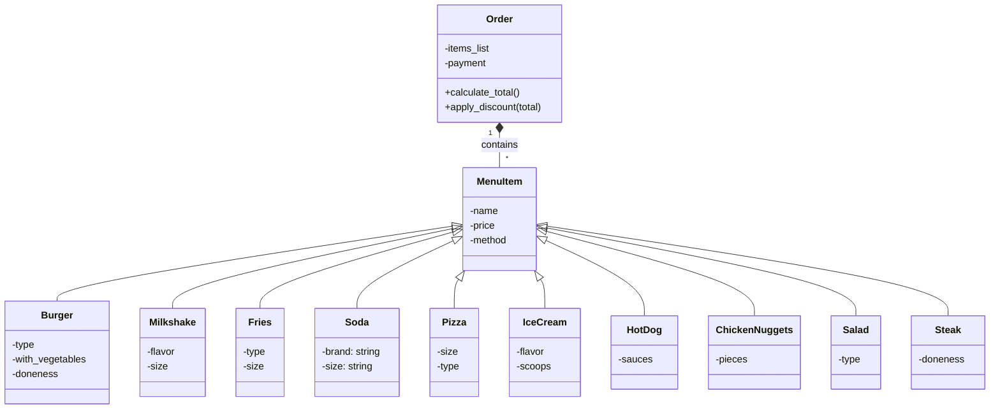

# Reto3_POO
Tercer Reto POO

Ejercicio Restaurante:
Se crea la clase MenuItem, la cual tiene como subclases los productos del menú, como Burger. Luego, se crea la clase Order la cual posee una lista con MenuItems y ahí hay métodos para calcular el total.



``` python
"""
There are 10 items on the menu, which have their own prices. However, if certain items are ordered together, 
a discount can be applied to the combo. The combos are:
    Personal: CheeseBurger + Fries + Soda             -10%
    Personal: Pizza + Milkshake                       -20%
    Familiar: ChickenNuggets + HotDog + Steak + Salad -30%

Aditionaly, the user can modify the size of some items, which will increase the base price. There are two options:
medium or large. The large size increases the base price by 25%.

Finally, there are three methods of payment: cash, card or nequi. The cash method has a 5% discount, the card increases
the total price by 5% and the nequi method has no discount or increase.
"""

class MenuItem:
    def __init__(self, name, price, method):
        self.name = name
        self.price = price
        self.method = method
        
class Burger(MenuItem):
    def __init__(self, name, price, type, with_vegetables, doneness, method) -> None:
        super().__init__(name, price, method)
        self.type = type
        self.with_vegetables = with_vegetables
        self.doneness = doneness
        
class Milkshake(MenuItem):
    def __init__(self, name, price, flavor, size, method) -> None:
        super().__init__(name, price, method)
        self.flavor = flavor
        self.size = size

class Fries(MenuItem):
    def __init__(self, name, price, type, size, method) -> None:
        super().__init__(name, price, method)
        self.size = size
        self.type = type
        
class Soda(MenuItem):
    def __init__(self, name, price, brand, size, method) -> None:
        super().__init__(name, price, method)
        self.brand = brand
        self.size = size

class Pizza(MenuItem):
    def __init__(self, name, price, size, type, method) -> None:
        super().__init__(name, price, method)
        self.size = size
        self.type = type

class IceCream(MenuItem):
    def __init__(self, name, price, flavor, scoops, method) -> None:
        super().__init__(name, price, method)
        self.flavor = flavor
        self.scoops = scoops
        
class HotDog(MenuItem):
    def __init__(self, name, price, sauces, method) -> None:
        super().__init__(name, price, method)
        self.sauces = sauces

class ChickenNuggets(MenuItem):
    def __init__(self, name, price, pieces, method) -> None:
        super().__init__(name, price, method)
        self.pieces = pieces

class Salad(MenuItem):
    def __init__(self, name, price, type, method) -> None:
        super().__init__(name, price, method)
        self.type = type
        
class Steak(MenuItem):
    def __init__(self, name, price, doneness, method) -> None:
        super().__init__(name, price, method)
        self.doneness = doneness
        
class Order():
    def __init__(self, items_list, payment) -> None:
        self.items_list = items_list
        self.payment = payment
        
    def calculate_total(self):  
        total = 0
        for item in self.items_list:
            try:                                    #Some items don't have size atribute
                if item.size == "2":
                    total += item.price * 1.25
                else:
                    total += item.price
            except:
                total += item.price
        return total

    def apply_discount(self, total):
        personal_combo = set(["CheeseBurger", "Fries", "Soda"])
        personal_combo2 = set(["Pizza", "Milkshake"])
        familiar_combo = set(["ChickenNuggets", "HotDog", "Steak", "Salad"])
        items = []
        for item in self.items_list:
            items.append(item.name)
        items = set(items)
        
        #Combos discounts
        if items == personal_combo:
            total = total * 0.9
            print("Personal combo discount applied")
        elif items == personal_combo2:
            total = total * 0.8
            print("Personal combo 2 discount applied")
        elif items == familiar_combo:
            total = total * 0.7
            print("Familiar combo discount applied")
        else:
            print("No combo discount applied")
        
        #Payments
        if self.payment == "cash":
            total = total * 0.95
            print("Cash payment applied")
        elif self.payment == "card":
            total = total * 1.05    
            print("Card payment applied")
        else:
            print("Nequi payment applied")
        return total

if __name__ == "__main__":
    print("Welcome, please select the items you want to order:")
    print("1. CheeseBurger")
    print("2. Fries")
    print("3. Soda")
    print("4. Pizza")
    print("5. Milkshake")
    print("6. IceCream")
    print("7. HotDog")
    print("8. ChickenNuggets")
    print("9. Salad")
    print("10. Steak")
    print("0. Finish order")   
    payment = input("Please select the payment method: (cash, card, nequi)\n")
    ordering = True
    order_list = []
    
    while ordering:
        orden = input("Select the item you want to order or type 0 to finish the order: ")
        if orden == "1":
            type = input("Select the type of burger: \n1. Beef + 0$\n2. Chicken +2000$ \n3. Veggie +3000$\n")
            with_vegetables = input("Do you want it with vegetables? (yes/no)\n")
            doneness = input("How do you want it cooked? \n1. Rare\n2. Medium \n3. Well done \n")
            if type == "2":
                order_list.append(Burger("CheeseBurger", 17000, type, with_vegetables, doneness, payment))
            elif type == "3":
                order_list.append(Burger("CheeseBurger", 18000, type, with_vegetables, doneness, payment))
            else:
                order_list.append(Burger("CheeseBurger", 15000, type, with_vegetables, doneness, payment))
            
            
        elif orden == "2":
            type = input("Select the type of fries: \n1. Regular +0$\n2. Curly +1000$\n")
            size = input("Select the size: \n1. Medium +0$\n2. Large +1750$\n")
            if type == "2":
                order_list.append(Fries("Fries", 8000, type, size, payment))
            else:
                order_list.append(Fries("Fries", 7000, type, size, payment))
            
        elif orden == "3":
            brand = input("Select the brand of the soda: \n1. CocaCola \n2. Pepsi \n")
            size = input("Select the size: \n1. Medium +0$\n2. Large +1250$\n")
            order_list.append(Soda("Soda", 5000, brand, size, payment)) 
            
        elif orden == "4":
            size = input("Select the size of the pizza: \n1. Medium +0$\n2. Large +2500$\n")
            type = input("Select the type of pizza: \n1. Pepperoni +0$\n2. Hawaiian +0$\n")
            order_list.append(Pizza("Pizza", 10000, size, type, payment))
        
        elif orden == "5":
            flavor = input("Select the flavor of the milkshake: \n1. Vanilla \n2. Chocolate \n")
            size = input("Select the size: \n1. Medium +0$\n2. Large +2500$\n")
            order_list.append(Milkshake("Milkshake", 10000, flavor, size, payment))
            
        elif orden == "6":
            flavor = input("Select the flavor of the ice cream: \n1. Vanilla +0$\n2. Chocolate +0$\n")
            scoops = input("Select the number of scoops: \n1. One +0$\n2. Two +2000$\n")
            if scoops == "2":
                order_list.append(IceCream("IceCream", 7000, flavor, scoops, payment))
            else:
                order_list.append(IceCream("IceCream", 5000, flavor, scoops, payment))
            
        
        elif orden == "7":
            sauces = input("Select the sauces: \n1. Ketchup \n2. Mustard \n")
            order_list.append(HotDog("HotDog", 8000, sauces, payment))
        
        elif orden == "8":
            pieces = input("Select the number of pieces: \n1. Six \n2. Twelve +10000$\n")
            if pieces == "2":
                order_list.append(ChickenNuggets("ChickenNuggets", 22000, pieces, payment))
            else:
                order_list.append(ChickenNuggets("ChickenNuggets", 12000, pieces, payment))

        elif orden == "9":
            type = input("Select the type of salad: \n1. Caesar \n2. Garden \n")
            order_list.append(Salad("Salad", 5000, type, payment))
        
        elif orden == "10":
            doneness = input("How do you want the steak cooked? \n1. Rare \n2. Medium \n3. Well done \n")
            order_list.append(Steak("Steak", 30000, doneness, payment))
            
        elif orden == "0":
            print("Order finished")
            ordering = False
        else:
            print("Invalid, please select a correct option")
            
    order = Order(order_list, payment)
    print(f"Total price: {order.calculate_total()}")
    print(f"Total price according to payment method and discount combos: {order.apply_discount(order.calculate_total())}")

```

EJERCICIO EN CLASE, LÍNEA PARAMETRIZADA Y RECTÁNGULO CONSTRUIDO A PARTIR DE 4 LÍNEAS

``` python
import math

class Point():
    def __init__(self, x, y):
        self.x = x
        self.y = y
        
class Rectangle():
    def __init__(self, method, *args):
        self.method = method

        if len(args) == 3:
            point = Point(args[0].x, args[0].y)
            width = args[1]
            height = args[2]    
            
        elif len(args) == 2:
            point1 = Point(args[0].x, args[0].y)
            point2 = Point(args[1].x, args[1].y)
            
        elif len(args) == 4:
            line1 = args[0]
            line2 = args[1]
            line3 = args[2]
            line4 = args[3]

        
        if method == "1":
            self.width = width
            self.height = height
            self.point_bottom_left_corner = point

        elif method == "2":
            self.width = width
            self.height = height
            self.point_center = point

        elif method == "3":
            self.point1 = point1
            self.point2 = point2
            self.width = abs(point1.x - point2.x)
            self.height = abs(point1.y - point2.y)
            
        elif method == "4":
            """
            Dadas 4 lineas, debemos ver que satisfacen las condiciones para formar un rectángulo: que tengan los lados
            paralelos dos a dos y que estos tengan longitudes iguales. Faltaría verificar que los lados se corten unos a otros
            sin embargo se asume que los puntos de fin y comienzo de las lineas sean 4 en total, es decir, que donde empiece una linea termine la otra
            """
            if (len(set([line1.length, line2.length, line3.length, line4.length])) == 2 or len(set([line1.length, line2.length, line3.length, line4.length])) == 1) and len(set([line1.slope, line2.slope, line3.slope, line4.slope])) == 2:
                self.width = min([line1.length, line2.length, line3.length, line4.length])
                self.height = max([line1.length, line2.length, line3.length, line4.length])
                print("Se ha construido un rectángulo")
            else:
                print("No se puede construir un rectángulo")
            
        
    def compute_area(self):
        print(f"El área del rectángulo es {self.width * self.height}") 

    def compute_perimeter(self):   
        print(f"El perímetro del rectángulo es {2 * (self.width + self.height)}")

    def compute_interference_point(self, point):
        if point.x >= self.point_bottom_left_corner.x and point.x <= self.point_bottom_left_corner.x + self.width and point.y >= self.point_bottom_left_corner.y and point.y <= self.point_bottom_left_corner.y + self.height:
            print(f"El punto {point.x, point.y} está dentro del rectángulo")
        else:
            print(f"El punto {point.x, point.y} está fuera del rectángulo")
    

class Line:
    
    def __init__(self, start, end) -> None:
        self.start = start
        self.end = end
        self.length = self.compute_length()
        self.slope = self.compute_slope()

    def compute_length(self):
        length = math.sqrt((self.start.x - self.end.x)**2 + (self.start.y - self.end.y)**2)
        return round(length,2)
    
    def compute_slope(self):
        try:
            m = (self.end.y - self.start.y)/(self.end.x - self.start.x)
            return round(m,2)
        except:
            return float("inf")
        

    def compute_horizontal_cross(self):
        pos_x_coordinate = (self.slope * self.start.x - self.start.y)/self.slope

        if pos_x_coordinate >= self.start.x and pos_x_coordinate <= self.end.x:
            return True
        else:
            return False
        
    def compute_vertical_cross(self):
        pos_y_coordinate = self.start.y - (self.slope*self.start.x)

        if pos_y_coordinate >= self.start.y and pos_y_coordinate <= self.end.y:
            return True
        else:
            return False
    
    def discretize_line(self, number_of_sections):
        array_of_points = []
        distance_points = self.length / number_of_sections
        
        if self.slope == float("inf"):
            for i in range(number_of_sections):
                array_of_points.append(Point(self.start.x, self.start.y + i*distance_points))
        if self.slope == 0:
            for i in range(number_of_sections):
                array_of_points.append(Point(self.start.x + i*distance_points, self.start.y))
        else:
            for i in range(number_of_sections):
                array_of_points.append(Point(self.start.x + i*distance_points, self.start.y + self.slope * i*distance_points))
        for point in array_of_points:
            print(f"({point.x}, {point.y})")
        
if __name__ == "__main__":
    
    method = input("Ingrese el método de construcción del rectángulo: 1, 2, 3, 4: ")
    if method == "4":
        print("Ingrese las coordenadas de los 4 puntos que forman el rectángulo en sentido antihorario: ")
        point1x = input("Ingrese la coordenada x del punto 1: ")
        point1y = input("Ingrese la coordenada y del punto 1: ")
        point2x = input("Ingrese la coordenada x del punto 2: ")
        point2y = input("Ingrese la coordenada y del punto 2: ")
        point3x = input("Ingrese la coordenada x del punto 3: ")
        point3y = input("Ingrese la coordenada y del punto 3: ")
        point4x = input("Ingrese la coordenada x del punto 4: ")
        point4y = input("Ingrese la coordenada y del punto 4: ")
        line1 = Line(Point(int(point1x), int(point1y)), Point(int(point2x), int(point2y)))
        line2 = Line(Point(int(point2x), int(point2y)), Point(int(point3x), int(point3y)))
        line3 = Line(Point(int(point3x), int(point3y)), Point(int(point4x), int(point4y)))
        line4 = Line(Point(int(point4x), int(point4y)), Point(int(point1x), int(point1y)))
        rect = Rectangle(method, line1, line2, line3, line4)
        try:
            rect.compute_area()
            rect.compute_perimeter()
        except:
            pass
    elif method == 2 or method == 1:
        x = input("Ingrese la coordenada x del punto: ")
        y = input("Ingrese la coordenada y del punto: ")
        width = input("Ingrese el ancho del rectángulo: ")
        height = input("Ingrese el alto del rectángulo: ")
        point = Point(int(x), int(y))
        rect = Rectangle(method, point, int(width), int(height))
        rect.compute_area()
        rect.compute_perimeter()
        
    elif method == 3:
        x1 = input("Ingrese la coordenada x del punto 1: ")
        y1 = input("Ingrese la coordenada y del punto 1: ")
        x2 = input("Ingrese la coordenada x del punto 2: ")
        y2 = input("Ingrese la coordenada y del punto 2: ")
        point1 = Point(int(x1), int(y1))
        point2 = Point(int(x2), int(y2))
        rect = Rectangle(method, point1, point2)
        rect.compute_area()
        rect.compute_perimeter()
        
```
